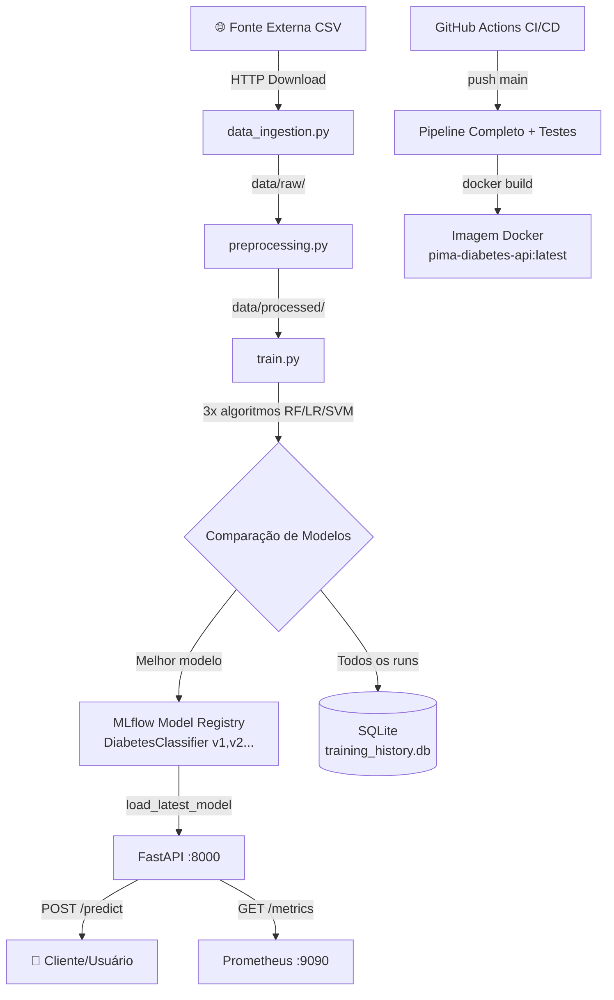
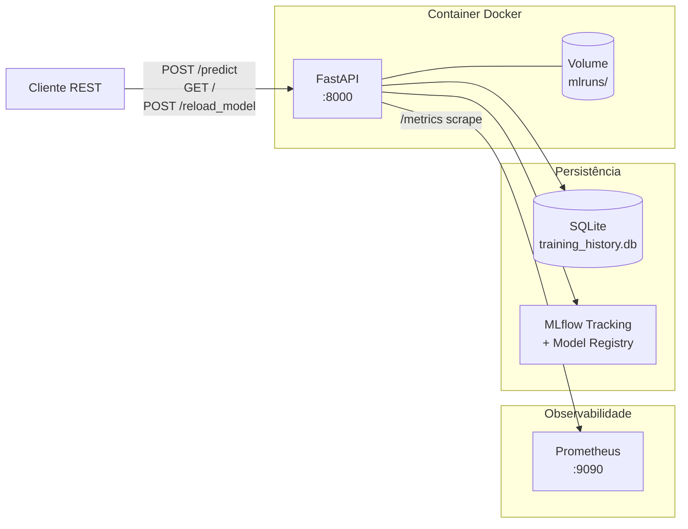

# 🏦 Santander Academia - Machine Learning Engineering Case

Este repositório contém a solução completa para o case de certificação em Engenharia de Machine Learning. A solução abrange desde a ingestão de dados até a implantação de uma API produtiva com monitoramento em tempo real, orquestração de pipelines e versionamento de modelos.

---

## 📋 I. Objetivo do Case

Desenvolver uma infraestrutura robusta de MLOps para o dataset **Pima Indians Diabetes**, permitindo:
- **Treinamento Automatizado**: Comparação de diferentes algoritmos (Random Forest, Logistic Regression, SVM).
- **Rastreabilidade**: Gerenciamento de artefatos e métricas via MLflow.
- **Persistência**: Registro histórico de execuções em banco de dados SQLite (PoC para SQL/NoSQL de larga escala).
- **Orquestração**: Pipeline agendável para processamento end-to-end.
- **Observabilidade**: Monitoramento de performance da API em tempo real.
- **Escalabilidade**: Arquitetura conteinerizada pronta para nuvem.

---

## 🏗️ II. Arquitetura da Solução

### Arquitetura de Solução (Fluxo de Dados — DAG)



### Arquitetura Técnica (Infraestrutura e Portas)



### Arquitetura Técnica (Componentes)

| Camada | Tecnologia | Justificativa |
|---|---|---|
| Ingestão/Preprocessamento | Pandas + NumPy | Padrão de mercado para ETL tabular |
| Treinamento | Scikit-Learn (RF, LogReg, SVM) | Comparação multi-algoritmo exigida pelo case |
| Gerenciamento de Artefatos | MLflow Tracking + **Model Registry** | Versionamento com stages (None → Production) |
| Persistência de Metadados | SQLite + SQLAlchemy ORM | Reprodutível localmente; migração trivial para PostgreSQL em produção |
| API de Inferência | FastAPI + Uvicorn + Pydantic | Async nativo, validação automática, OpenAPI/Swagger embutido |
| Observabilidade | `prometheus-fastapi-instrumentator` + `logging` | Métricas de infraestrutura expostas em `/metrics`; logs estruturados por componente |
| Orquestração | `pipeline_manager.py` + `schedule` | DAG sequencial com early-stop em falha; agendável (`--demo`: 1min, produção: 24h) |
| Infraestrutura | Docker + GitHub Actions | Reprodutibilidade via container; CI/CD completo em push ao main |

---

## ⚙️ III. Plano de Implementação (Explicação Técnica)

O projeto foi estruturado para ser modular e extensível. Cada etapa do pipeline é indepedente, mas orquestrada pelo `pipeline_manager.py`:

1.  **Ingestão (`data_ingestion.py`)**: Carrega dados brutos de fontes externas e garante a persistência local em `/data/raw`.
2.  **Pré-processamento (`preprocessing.py`)**: Realiza limpeza de dados, como tratamento de valores nulos (zeros substituídos pela mediana), garantindo a qualidade para os modelos.
3.  **Treinamento (`train.py`)**: 
    - Treina três algoritmos simultaneamente para comparação de performance.
    - O **MLflow** registra os parâmetros e modelos.
    - O banco **SQLite** armazena o histórico de treino com `timestamp`, `accuracy` e `f1_score`, permitindo auditoria rápida sem dependências externas complexas.
4.  **Orquestração (`pipeline_manager.py`)**: Implementa a lógica de uma **DAG** (Directed Acyclic Graph) para garantir que uma etapa só ocorra após o sucesso da anterior. Inclui suporte a agendamento via biblioteca `schedule`.
5.  **API e Observabilidade (`api.py`)**: 
    - Expõe o endpoint `/predict` para consumo em tempo real.
    - Expõe o endpoint `/metrics` para ferramentas de monitoramento.
    - Inclui endpoint `/reload_model` para atualização a quente sem downtime.

---

## 🚀 IV. Melhorias e Considerações Finais

### Escalabilidade e Produção
Para um ambiente de produção real com "grande volume de dados", a arquitetura permite:
- **Horizontal Scaling**: O contêiner Docker pode ser replicado em um cluster **Kubernetes (K8s)**.
- **Big Data Storage**: Substituição do SQLite por **PostgreSQL (RDS/Cloud SQL)** ou Data Lakes (**S3/Azure Blob**).
- **Distributed Training**: Integração com **Apache Spark** ou **Dask** para volumes massivos de dados.

### Considerações Finais
A solução demonstra domínio completo sobre o ciclo de vida de Machine Learning (ML Lifecycle), priorizando a **reprodutibilidade**, **segurança** (via containers isolados) e **eficiência** operacional.

---

## 🛠️ Como Reproduzir (Quick Start)

### 1. Criar Ambiente Virtual e Instalar Libs
```bash
python -m venv venv
# Windows
.\venv\Scripts\activate
# Linux/Mac
source venv/bin/activate

pip install -r requirements.txt
```

### 2. Executar Pipeline Completa (Ingestão -> Treino)
```bash
python src/pipeline_manager.py
```
*Isso gerará o `mlruns`, `mlflow.db` e o `training_history.db`.*

### 3. Iniciar API com Observabilidade
```bash
uvicorn src.api:app --reload
```
Acesse:
- **Interativo (Swagger)**: `http://127.0.0.1:8000/docs`
- **Métricas**: `http://127.0.0.1:8000/metrics`

---
**Candidato:** Arthur S. (e Antigravity AI)
**Data:** 04/04/2026
