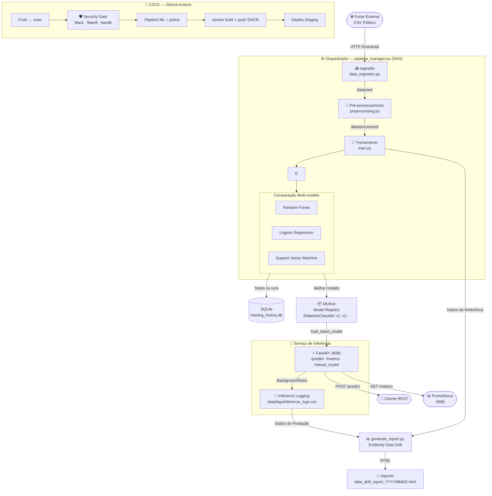
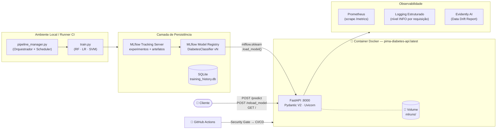

<div align="center">

# Santander ML Pipeline

### Case de Certificação — Academia Santander · Engenharia de Machine Learning

[](https://www.python.org/)
[](https://fastapi.tiangolo.com/)
[](https://mlflow.org/)
[](https://www.docker.com/)
[](https://github.com/features/actions)
[](https://scikit-learn.org/)
[](https://prometheus.io/)
[](https://www.evidentlyai.com/)
[](https://www.sqlite.org/)

<br/>

> Pipeline completo de MLOps — da ingestão de dados brutos à API em produção com monitoramento em tempo real, orquestração agendável e versionamento de modelos.

</div>

---

## 🚀 Novas Funcionalidades (v2.0)

- **Modo Big Data Automático:** Transição de Pandas para Dask + SGDClassifier com `partial_fit` para arquivos > 500MB.
- **Observabilidade Ativa:** Shadow Logging e Data Drift com Evidently.
- **Deploy Cloud-Native:** Kubernetes HPA.

---

## Sumário

- [🚀 Novas Funcionalidades (v2.0)](#-novas-funcionalidades-v20)
- [I. Objetivo do Case](#-i-objetivo-do-case)
- [II. Arquitetura de Solução](#-ii-arquitetura-de-solução)
- [III. Plano de Implementação e Reprodução](#-iii-plano-de-implementação-e-reprodução)
- [IV. Melhorias e Considerações Finais](#-iv-melhorias-e-considerações-finais)

---

## 🎯 I. Objetivo do Case

Este projeto implementa uma solução completa de **MLOps (Machine Learning Operations)** como resposta ao case de certificação da **Academia Santander**. O domínio escolhido é **saúde pública**: a previsão de ocorrência de diabetes utilizando o dataset _Pima Indians Diabetes_ (768 pacientes, 8 features clínicas), expondo o resultado via API REST de baixa latência.

O objetivo não é apenas construir um modelo — é construir a **infraestrutura que gerencia o ciclo de vida inteiro do modelo**, cobrindo todos os seis pilares mandatórios do edital:

| Pilar                          | Requisito do Edital                               | Implementação                                                             |
| ------------------------------ | ------------------------------------------------- | ------------------------------------------------------------------------- |
| **Treinamento**                | Múltiplos algoritmos com comparação de desempenho | RF, Logistic Regression e SVM treinados simultaneamente                   |
| **CI/CD**                      | Integração e deploy contínuos automáticos         | GitHub Actions com Security Gate (black, flake8, bandit) + push GHCR      |
| **Orquestração**               | Fluxo completo com agendamento de pipelines       | `MLPipelineOrchestrator` com DAG sequencial + `schedule`                  |
| **Gerenciamento de Artefatos** | Versionamento de modelos e métricas               | MLflow Tracking + **Model Registry** com versões incrementais             |
| **Observabilidade**            | Métricas de desempenho em tempo real              | Prometheus `/metrics` + Inference Logging + Data Drift Report (Evidently) |
| **Escalabilidade**             | Dimensionamento horizontal dos recursos           | Docker + Kubernetes (Deployment, Service, HPA) + GitHub Actions           |
| **Segurança**                  | Análise estática de vulnerabilidades (SAST)       | Bandit no CI + Secrets via K8s Opaque + Shift-Left Security               |

---

## 🏗️ II. Arquitetura de Solução

### 2.1 Visão Conceitual — Fluxo de Dados (DAG)

O pipeline é estruturado como um **DAG (Directed Acyclic Graph) sequencial**: cada etapa só é executada se a anterior for concluída com sucesso. Uma falha em qualquer ponto interrompe o pipeline, prevenindo que dados desatualizados alimentem um novo treinamento.



### 2.2 Arquitetura Técnica — Componentes e Infraestrutura



### 2.3 Justificativas Tecnológicas

| Componente                       | Tecnologia Escolhida                | Alternativas Consideradas | Decisão                                                                                                                                       |
| -------------------------------- | ----------------------------------- | ------------------------- | --------------------------------------------------------------------------------------------------------------------------------------------- |
| **Framework de API**             | FastAPI                             | Flask, Django REST        | FastAPI: validação automática (Pydantic), OpenAPI/Swagger embutido, suporte async nativo e performance superior                               |
| **Rastreamento de Experimentos** | MLflow                              | W&B, Neptune, DVC         | MLflow: open-source, auto-hospedado, Model Registry integrado, sem custo em PoC                                                               |
| **Persistência de Metadados**    | SQLite + SQLAlchemy                 | PostgreSQL, MongoDB       | SQLite: zero infraestrutura para reprodutibilidade local; SQLAlchemy abstrai o dialeto — migração para PostgreSQL é uma linha                 |
| **Orquestração**                 | `pipeline_manager.py` + `schedule`  | Apache Airflow, Prefect   | Airflow requer PostgreSQL + Redis + Celery; para PoC, o orquestrador customizado elimina dependências externas sem sacrificar a lógica de DAG |
| **Observabilidade**              | `prometheus-fastapi-instrumentator` | Datadog, New Relic        | Solução open-source, scrape-ready para Grafana, zero configuração de servidor externo                                                         |
| **Infraestrutura**               | Docker + GitHub Actions             | Terraform + Jenkins       | Docker para portabilidade; GitHub Actions para integração nativa com o repositório                                                            |

---

## ⚙️ III. Plano de Implementação e Reprodução

### 3.1 Estrutura do Projeto

```
santander-ml-pipeline/
├── src/
│   ├── data_ingestion.py     # Etapa 1 — Ingestão multi-formato: CSV, Excel (.xlsx/.xls) e Parquet
│   ├── preprocessing.py      # Etapa 2 — Limpeza e imputação por mediana
│   ├── train.py              # Etapa 3 — Treino multi-modelo + MLflow + SQLite
│   ├── generate_report.py    # Etapa 4 — Data Drift Report (Evidently AI)
│   ├── pipeline_manager.py   # Orquestrador: DAG sequencial + scheduler + reporting
│   ├── api.py                # FastAPI: /predict · /metrics · /reload_model + Inference Logging
│   └── test_api.py           # Testes automatizados com pytest
├── k8s/
│   ├── deployment.yaml       # Deployment: 3 réplicas + probes + ConfigMap/Secret refs
│   ├── service.yaml          # Service: LoadBalancer :80 → :8000
│   ├── hpa.yaml              # HPA: autoscaling CPU 70% / Mem 80% (3–10 réplicas)
│   └── configmap-secret.yaml # ConfigMap + Secret Opaque (DATABASE_URL base64)
├── observability/
│   ├── prometheus.yml        # Scrape config: 5s interval → FastAPI /metrics
│   └── README.md             # Queries PromQL (erro 5xx, P95 latência, throughput)
├── .github/
│   └── workflows/ci.yml      # CI/CD: Security Gate → Pipeline → Tests → GHCR Push
├── docker-compose.observability.yml  # Stack: API + Prometheus + Grafana
├── Dockerfile                # Container Python 3.11-slim
├── requirements.txt          # Dependências de produção (Python 3.11+)
├── requirements-dev.txt      # Dependências de CI: black, flake8, bandit
├── pyrightconfig.json        # Configuração Pylance/pyright
├── .gitignore                # Exclui venv/, mlruns/, *.db, data/, reports/
└── README.md                 # Este documento
```

### 3.2 Pré-requisitos

| Ferramenta          | Versão mínima | Verificação        |
| ------------------- | ------------- | ------------------ |
| Python              | **3.11+**     | `python --version` |
| pip                 | 23+           | `pip --version`    |
| Git                 | Qualquer      | `git --version`    |
| Docker _(opcional)_ | 20+           | `docker --version` |

> **Atenção:** Os pacotes em `requirements.txt` exigem Python ≥ 3.11. O Dockerfile e o workflow de CI/CD estão configurados com Python 3.11.
>
> **Nota Python 3.14:** O pipeline foi testado e é compatível com Python 3.14, com uma única exceção: o pacote **Evidently** foi desabilitado por incompatibilidade com `pydantic.v1` nessa versão. Todas as demais funcionalidades (ingestão, pré-processamento, treinamento, API, MLflow) operam normalmente.

---

### 3.3 Guia de Reprodução Passo a Passo

#### Passo 1 — Clonar o Repositório

```bash
git clone https://github.com/<seu-usuario>/santander-ml-pipeline.git
cd santander-ml-pipeline
```

#### Passo 2 — Criar e Ativar o Ambiente Virtual

```bash
python -m venv venv
```

```bash
# Windows (PowerShell)
.\venv\Scripts\Activate.ps1

# Linux / macOS
source venv/bin/activate
```

#### Passo 3 — Instalar Dependências

```bash
pip install -r requirements.txt
```

#### Passo 4 — Configurar o PYTHONPATH

```bash
# Windows (PowerShell) — necessário para imports relativos
$env:PYTHONPATH = "."

# Linux / macOS
export PYTHONPATH=.
```

---

### 3.4 Executando o Pipeline

#### Modo único — executa uma vez e encerra (padrão do CI/CD)

```bash
# Windows
$env:PYTHONPATH="."; python src/pipeline_manager.py

# Linux / macOS
PYTHONPATH=. python src/pipeline_manager.py
```

**Saída esperada:**

```
2026-04-04 10:00:00 - INFO - === Iniciando execução do Pipeline de ML ===
2026-04-04 10:00:00 - INFO - Etapa 1: Iniciando Ingestão de Dados...
Dados salvos com sucesso em: data/raw/pima_diabetes.csv — (768, 9)
2026-04-04 10:00:01 - INFO - Etapa 2: Iniciando Pré-processamento...
Dados processados salvos em: data/processed/pima_diabetes_processed.csv
2026-04-04 10:00:01 - INFO - Etapa 3: Iniciando Treinamento...
RandomForest      → Acc: 0.7727 | F1: 0.6667
LogisticRegression → Acc: 0.7662 | F1: 0.6383
SVM               → Acc: 0.7597 | F1: 0.6301

Melhor modelo: RandomForest | Acc: 0.7727
Modelo registrado: DiabetesClassifier | Versão: 1 | Run ID: abc123...
2026-04-04 10:00:15 - INFO - === Pipeline finalizado com SUCESSO em 14.32s ===
```

#### Modo demonstração — scheduler ativo com ciclo de 1 minuto

Ideal para demonstrar o agendamento ao vivo durante a apresentação.

```bash
# Windows
$env:PYTHONPATH="."; python src/pipeline_manager.py --demo

# Linux / macOS
PYTHONPATH=. python src/pipeline_manager.py --demo
```

```
2026-04-04 10:00:00 - INFO - Modo DEMO: pipeline agendada para cada 1 minuto.
2026-04-04 10:00:00 - INFO - Agendador iniciado. Aguardando próxima execução...
# Pipeline re-executa automaticamente a cada 60s — Ctrl+C para encerrar
```

#### Modo Big Data — para arquivos grandes (> 500MB)

```bash
# Windows (PowerShell)
$env:USE_DASK="true"; python src/pipeline_manager.py

# Linux / macOS
USE_DASK="true" python src/pipeline_manager.py
```

---

### 3.5 Iniciando a API de Inferência

```bash
uvicorn src.api:app --reload
```

| Endpoint                             | Método | Descrição                                  |
| ------------------------------------ | ------ | ------------------------------------------ |
| `http://localhost:8000/`             | `GET`  | Health check — status da API e do modelo   |
| `http://localhost:8000/docs`         | `GET`  | Swagger UI interativo                      |
| `http://localhost:8000/predict`      | `POST` | Inferência — retorna predição e confiança  |
| `http://localhost:8000/reload_model` | `POST` | Hot-reload do modelo sem downtime          |
| `http://localhost:8000/metrics`      | `GET`  | Métricas Prometheus (latência, throughput) |

**Exemplo de requisição ao `/predict`:**

```bash
curl -X POST http://localhost:8000/predict \
  -H "Content-Type: application/json" \
  -d '{
    "preg": 1.0, "plas": 85.0, "pres": 66.0, "skin": 29.0,
    "test": 0.0, "mass": 26.6, "pedi": 0.351, "age": 31.0
  }'
```

**Resposta:**

```json
{
  "predicao": "Negativo para Diabetes",
  "confianca": 0.8423,
  "modelo_versao": "mlruns/1/abc123.../artifacts/model",
  "latencia_s": 0.0031
}
```

> Se o modelo não estiver carregado, a API retorna **HTTP 503** com a mensagem de erro adequada — nunca um 200 enganoso.

---

### 3.6 Acessando o MLflow UI

```bash
mlflow ui
# Acesse: http://localhost:5000
```

No MLflow UI é possível:

- Comparar accuracy e F1 entre os três algoritmos por execução
- Navegar até **Model Registry → DiabetesClassifier** e ver o histórico de versões
- Baixar qualquer artefato de modelo por `run_id`

---

### 3.7 Executando os Testes Automatizados

```bash
pytest src/test_api.py -v
```

```
src/test_api.py::test_predict_endpoint PASSED   [ 50%]
src/test_api.py::test_health_check     PASSED   [100%]
============ 2 passed in 1.23s ============
```

---

### 3.8 Execução via Docker

```bash
# Build da imagem (lowercase obrigatório para GHCR)
docker build -t ghcr.io/arthurs357/santander-ml-pipeline/pima-diabetes-api:latest .

# Execução do container
docker run -d -p 8000:8000 --name diabetes-api \
  ghcr.io/arthurs357/santander-ml-pipeline/pima-diabetes-api:latest

# Verificar logs
docker logs diabetes-api

# Testar
curl http://localhost:8000/
```

---

### 3.9 Esteira de CI/CD — GitHub Actions

Toda alteração no branch `main` dispara automaticamente o workflow `.github/workflows/ci.yml`:

```
Push/PR → main
    │
    ├─ 1. Checkout + Python 3.11
    ├─ 2. pip install -r requirements.txt + requirements-dev.txt
    ├─ 3. 🛡️ Security Gate:
    │     ├─ black --check src/              ← formatação PEP 8
    │     ├─ flake8 src/                     ← linting estático
    │     └─ bandit -r src/                  ← SAST (vulnerabilidades)
    ├─ 4. python src/pipeline_manager.py     ← executa o DAG completo
    ├─ 5. pytest src/test_api.py -v          ← valida a API
    ├─ 6. docker login ghcr.io               ← auth via GITHUB_TOKEN
    ├─ 7. docker build + push GHCR           ← imagem :latest + :sha
    └─ 8. Deploy (Staging simulation)
```

> **Shift-Left Security:** black, flake8 e bandit rodam **antes** dos testes. O CI falha imediatamente se houver falha de formatação, lint ou vulnerabilidade — código inseguro nunca chega à produção.

---

### 3.10 Deploy Cloud-Native (Kubernetes)

```bash
kubectl apply -f k8s/configmap-secret.yaml
kubectl apply -f k8s/deployment.yaml
kubectl apply -f k8s/service.yaml
kubectl apply -f k8s/hpa.yaml
```

---

## 🚀 IV. Melhorias e Considerações Finais

### 4.1 Limitações Conhecidas e Decisões de Trade-off

| Limitação                                            | Contexto                                                                        | Solução em Produção                                                                                                    |
| ---------------------------------------------------- | ------------------------------------------------------------------------------- | ---------------------------------------------------------------------------------------------------------------------- |
| SQLite não suporta múltiplos escritores              | Pipeline sequencial — sem concorrência no PoC                                   | Substituir por PostgreSQL (trocar `DATABASE_URL`)                                                                      |
| Mediana calculada no dataset completo (data leakage) | Impacto mínimo em 768 linhas                                                    | `sklearn.Pipeline` + `SimpleImputer` ajustado só no treino                                                             |
| Modelo embarcado na imagem Docker                    | Simplifica o PoC                                                                | Montar `mlruns/` como volume ou carregar do Registry por URI                                                           |
| **Evidently desabilitado no Python 3.14**            | `pydantic.v1` não é importável no Python 3.14; Data Drift Report retorna `None` | Evidently funciona normalmente no Docker (Python 3.11); para Python 3.14 use `generate_report.py` com guarda de import |

### 4.2 Implementado vs. Roadmap

```
✅ Implementado
├── Security Gate no CI: black + flake8 + bandit (Shift-Left Security)
├── Push automático de imagem para GHCR no CI (docker/login-action)
├── Monitoramento de Data Drift com Evidently AI (generate_report.py)
├── Inference Logging via BackgroundTasks (data/logs/inference_logs.csv)
├── Sistema de Alertas: WARNING quando drift_share > threshold
├── docker-compose.observability.yml com API + Prometheus + Grafana
├── Kubernetes: Deployment + Service + HPA + ConfigMap/Secret
└── Pydantic V2 (model_dump) — sem warnings de deprecação

🔜 Roadmap (próximas iterações)
├── Métricas de negócio customizadas (taxa de positivos, distribuição de confiança)
├── PostgreSQL (RDS/Cloud SQL) para persistência de metadados
├── Retry com backoff exponencial na ingestão (biblioteca tenacity)
├── Apache Airflow ou Prefect para DAGs visuais com retry e SLA
├── Feature Store (Feast) para centralizar features de treino e inferência
├── A/B Testing entre versões do modelo em produção simultânea
└── MLflow Model Serving com stage Production → Staging → Archived
```

### 4.3 Considerações Finais

A solução demonstra domínio do **ciclo de vida completo de Machine Learning em produção**. As escolhas tecnológicas foram guiadas por três princípios:

- **Reprodutibilidade:** qualquer pessoa com Python 3.11 e `pip install -r requirements.txt` consegue executar o pipeline do zero — sem provisionar nenhuma infraestrutura externa.
- **Rastreabilidade:** cada execução gera registros imutáveis no MLflow (artefatos + métricas) e no SQLite (metadados), permitindo auditar qualquer predição até seu run de origem.
- **Evolução incremental:** cada componente foi projetado para ser substituído pela sua versão de produção de forma independente, sem refatoração da lógica de negócio.

---

## 🚀 Como Rodar Offline (Ambiente Restrito)

Se o ambiente não tem acesso ao GitHub ou à internet, você pode rodar os novos scripts de inicialização `setup_enterprise.ps1` (Windows) ou `setup_enterprise.sh` (Linux), que já contêm bypass de proxy e configuração SSL corporativa para baixar os pacotes necessários com segurança.

Alternativamente, basta colocar o arquivo de dados dentro da pasta `data/raw/` e executar os comandos abaixo.  
O pipeline detecta automaticamente o formato do arquivo (CSV, Excel ou Parquet) e usa o MLflow em SQLite local.

### 📁 Pré‑requisito

Certifique‑se de que o dataset existe localmente em um dos formatos suportados:

```
data/raw/pima_diabetes.csv      ← padrão (fallback)
data/raw/pima_diabetes.xlsx     ← Excel (aponta via RAW_DATA_URL)
data/raw/pima_diabetes.parquet  ← Parquet (aponta via RAW_DATA_URL)
```

### 💻 Execução

**Windows (PowerShell)**

```powershell
# CSV (padrão — RAW_DATA_URL omitido usa o fallback)
$env:MLFLOW_TRACKING_URI = "sqlite:///./mlflow.db"
$env:PYTHONPATH = "."
venv\Scripts\python.exe src/pipeline_manager.py

# Excel
$env:RAW_DATA_URL = "data/raw/pima_diabetes.xlsx"
$env:MLFLOW_TRACKING_URI = "sqlite:///./mlflow.db"
$env:PYTHONPATH = "."
venv\Scripts\python.exe src/pipeline_manager.py

# Parquet
$env:RAW_DATA_URL = "data/raw/pima_diabetes.parquet"
$env:MLFLOW_TRACKING_URI = "sqlite:///./mlflow.db"
$env:PYTHONPATH = "."
venv\Scripts\python.exe src/pipeline_manager.py
```

**Linux / macOS (bash/zsh)**

```bash
# CSV (padrão)
export MLFLOW_TRACKING_URI="sqlite:///./mlflow.db"
export PYTHONPATH="."
python src/pipeline_manager.py

# Excel
RAW_DATA_URL="data/raw/pima_diabetes.xlsx" MLFLOW_TRACKING_URI="sqlite:///./mlflow.db" PYTHONPATH="." python src/pipeline_manager.py

# Parquet
RAW_DATA_URL="data/raw/pima_diabetes.parquet" MLFLOW_TRACKING_URI="sqlite:///./mlflow.db" PYTHONPATH="." python src/pipeline_manager.py
```

- `RAW_DATA_URL` → caminho do arquivo de entrada; se omitido, usa `data/raw/pima_diabetes.csv`.
- `MLFLOW_TRACKING_URI=sqlite:///./mlflow.db` → evitar servidor remoto.
- `PYTHONPATH="."` → importar módulos do projeto.

### 🏔️ Modo Caverna — Economia de Tokens

Para ambientes com restrição severa (sem rede, sem LLM externo, sem telemetria), exporte todas as variáveis de uma vez antes de executar:

**Windows (PowerShell)**

```powershell
$env:RAW_DATA_URL        = "data/raw/pima_diabetes.csv"
$env:MLFLOW_TRACKING_URI = "sqlite:///./mlflow.db"
$env:PYTHONPATH          = "."
venv\Scripts\python.exe src/pipeline_manager.py
```

**Linux / macOS**

```bash
export RAW_DATA_URL="data/raw/pima_diabetes.csv"
export MLFLOW_TRACKING_URI="sqlite:///./mlflow.db"
export PYTHONPATH="."
python src/pipeline_manager.py
```

> Neste modo, o pipeline opera 100% offline: lê o arquivo local, treina, registra artefatos no SQLite e encerra — sem chamadas externas.

---

## 📂 Formatos de Dados Suportados (Offline)

### 📥 Entrada de Dados (Ingestão)

| Formato                  | Suporte Offline | Como usar                                                                                          |
| ------------------------ | --------------- | -------------------------------------------------------------------------------------------------- |
| **CSV**                  | ✅ Sim          | Padrão. Leitura via `pandas.read_csv()`. Nenhuma variável extra necessária.                        |
| **Excel (.xlsx / .xls)** | ✅ Sim          | Defina `RAW_DATA_URL=data/raw/pima_diabetes.xlsx`. Requer `openpyxl` (já no `requirements.txt`).   |
| **Parquet**              | ✅ Sim          | Defina `RAW_DATA_URL=data/raw/pima_diabetes.parquet`. Requer `pyarrow` (já no `requirements.txt`). |

A detecção de formato é automática em `data_ingestion.py` via `os.path.splitext()`. O resultado é sempre salvo como `data/raw/pima_diabetes.csv` para compatibilidade com as etapas seguintes do pipeline.

### 📤 Saída de Relatórios

#### 1. Relatório de Data Drift (Evidently)

- **Status atual:** **Desabilitado** (retorna `None`) devido à incompatibilidade com Python 3.14.
- **Formato original (se ativo):** HTML interativo (`reports/data_drift_report_YYYYMMDD.html`).
- **Offline:** Funcionaria offline, pois o Evidently gera o HTML localmente.

#### 2. Métricas e Logs de Inferência

- **Local:** `data/logs/inference_logs.csv`
- **Formato:** CSV (legível por Excel, Google Sheets, Pandas).
- **Offline:** ✅ Totalmente funcional.

#### 3. Registros do MLflow

- **Local:** `mlruns/` e `mlflow.db` (SQLite)
- **Offline:** ✅ A UI do MLflow (`mlflow ui`) funciona localmente sem internet.

#### 4. Saída do Pipeline Manager

- **Formato:** Logs em console e arquivo (se configurado).
- **Offline:** ✅ Sem dependência externa.

### 🔄 Adaptação para Outros Relatórios

Se a necessidade é gerar **relatórios customizados em Excel/PDF** a partir dos dados processados ou das predições:

| Ferramenta        | Como Implementar                                                                   |
| ----------------- | ---------------------------------------------------------------------------------- |
| **Excel (.xlsx)** | Adicionar `openpyxl` ou `xlsxwriter` ao `requirements.txt` e usar `df.to_excel()`. |
| **PDF**           | Usar `reportlab` ou `weasyprint` (mais complexo, requer dependências de sistema).  |

> ⚠️ **Lembre-se:** qualquer nova dependência deve ser instalada **antes** de entrar no ambiente offline (via `pip download` ou espelho interno).

---

<div align="center">

**Candidato:** Arthur S.
**Certificação:** Academia Santander — Engenharia de Machine Learning
**Data:** Abril/2026

</div>
